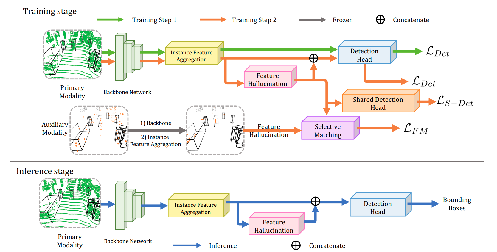

<div align = "center">

# Robust 3D Object Detection from LiDAR-Radar Point Clouds Via Cross-Modal Feature Augmentation

</div>

[](https://arxiv.org/abs/2309.17336)
[](https://youtu.be/378lnj2ku60?si=4UNGlzKXXznaPSXB) 

This is the official repository of **Cross-Modal Feature Augmentation**, a cross-modal framework for 3D object detection. For technical details please refer to our paper on ICRA 2024:


**Robust 3D Object Detection from LiDAR-Radar Point Clouds Via Cross-Modal Feature Augmentation**
<br>
[Jianning Deng](https://github.com/DJNing), [Gabriel Chan](https://github.com/gc625), [Hantao Zhong](https://github.com/MrTooOldDriver), [Chris Xiaoxuan Lu](https://christopherlu.github.io/)
</br>


## Citation
If you find our work useful in your research, please consider citing:


```shell
@misc{deng2023seeing,
      title={See Beyond Seeing: Robust 3D Object Detection from Point Clouds via Cross-Modal Hallucination}, 
      author={Jianning Deng and Gabriel Chan and Hantao Zhong and Chris Xiaoxuan Lu},
      year={2023},
      eprint={2309.17336},
      archivePrefix={arXiv},
      primaryClass={cs.CV}
}
```

## Getting Started

To find out how to run our experiments, please see our intructions in [GETTING_STARTED](./docs/GETTING_STARTED.md). If you run into any issues when runinng our code, please raise them under this repository.


## Abstract 
This paper presents a novel framework for robust 3D object detection from point clouds via cross-modal
hallucination. Our proposed approach is agnostic to either
hallucination direction between LiDAR and 4D radar. We
introduce multiple alignments on both spatial and feature levels
to achieve simultaneous backbone refinement and hallucination
generation. Specifically, spatial alignment is proposed to deal
with the geometry discrepancy for better instance matching
between LiDAR and radar. The feature alignment step further
bridges the intrinsic attribute gap between the sensing modalities and stabilizes the training. The trained object detection
models can deal with difficult detection cases better, even though
only single-modal data is used as the input during the inference
stage. Extensive experiments on the View-of-Delft (VoD) dataset
show that our proposed method outperforms the state-of-theart (SOTA) methods for both radar and LiDAR object detection
while maintaining competitive efficiency in runtime.

## Method
|  | 
|:--:| 
|***Figure 1. Method Overview.** The upper figure illustrates the 2-step training strategy, blocks used in the first step of training are connected with green line and those for the second step are connected with orange line. Note the primary and auxiliary data can be interchangeable among two sensor modalities (radar and LiDAR) depending on the end goal. Only single modal data (primary modal) will be used during inference as shown in the lower figure connected with blue line.*|

